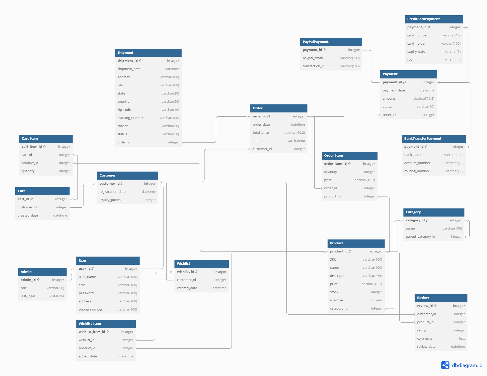

# ClickToBuy

**ClickToBuy** is a fully-featured online web store platform built using Laravel framework.  
It enables customers to browse, purchase, and manage products, while providing administrative tools for managing the store efficiently.

---

## Project Scope

This project is developed as part of a data engineering course. It includes:

- Customer registration, authentication, and order management
- Admin panel for managing products, categories, and users
- Dynamic product catalog with cart and wishlist functionality
- Multiple payment methods with extensible design
- API support using JSON and XML for data exchange
- Structured backend using the MVC design pattern

---

## ⚙️ Technologies Used

- **Laravel** – PHP framework for backend development
- **MySQL** – Relational database, managed with phpMyAdmin
- **Bootstrap** – Responsive and modern styling
- **Blade** – Laravel's templating engine
- **HTML / CSS / JavaScript** – For frontend development
- **JSON & XML APIs** – For client-server communication
- **MVC Architecture** – Separation of concerns and maintainable codebase

---

## Deliverables

- [x] **Written Proposal** – See [`docs/proposal.md`](docs/proposal.md)
- [x] **Software Requirements Specification (SRS)** – See [`docs/SRS.md`](docs/SRS.md)
- [x] **Entity-Relationship Diagram (ERD)** – See below and [`docs/ERD.png`](docs/ERD.png)

  

- [x] **README / Project Report** – Overview of scope, tools, and design

---

## Design Overview

- **Inheritance modeling**: Customers and Admins extend from a common User entity
- **Polymorphic payments**: Supports Credit Card, PayPal, and Bank Transfer via a parent Payment table
- **API-Ready**: Easily integrates with frontends or third-party services using JSON or XML
- **Responsive Interface**: Built with Bootstrap and Blade templates
- **Organized Architecture**: Clean separation of models, views, and controllers using MVC

---

## Stakeholders

- **Customers** – End-users who browse and purchase products
- **Admins** – Store managers responsible for system operations
- **Developers** – Build, maintain, and scale the platform

---

## Use Case Examples

- A customer signs up, adds items to their cart, and completes a purchase using PayPal.
- An admin logs in, updates product inventory, and monitors order statuses.
- An external system fetches product data using a JSON API for integration with another service.
